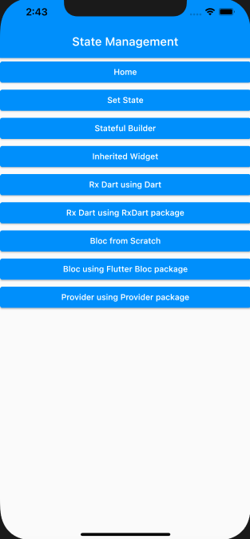
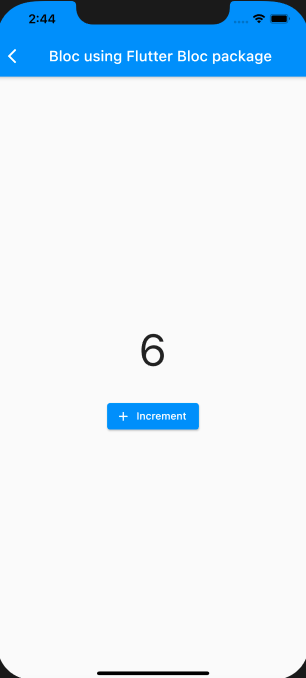
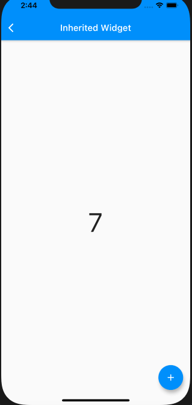
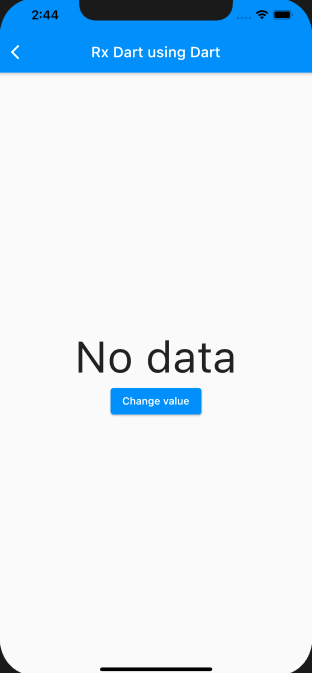

# flutter-state-management

- bloc
- rx-dart
- stateful-builder
- inherited-widgets
- provider

## Table of contents

- [Getting started](#getting-started)
- [Images](#images)
- [License](#license)

## Getting started

**Clone the repo**

```bash
git clone https://github.com/AkashSDas/flutter-state-management.git
```

**Get inside the project dir and install dependencies**

```bash
cd flutter-state-management
flutter pub get
```

**Open a simulator or connect a device and after that execute the below command to run the flutter app**

```bash
flutter run
```

## Images






## License

[License](./LICENSE)
